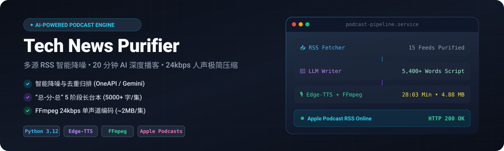
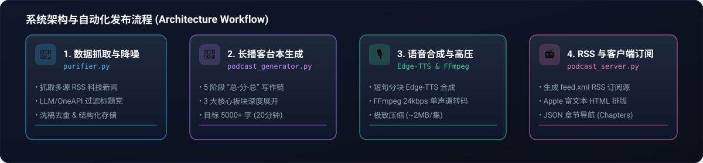

<p align="center">
  
</p>

<p align="center">
  <a href="https://python.org"></a>
  <a href="https://github.com/astral-sh/uv"></a>
  <a href="https://github.com/rany2/edge-tts"></a>
  <a href="https://ffmpeg.org/"></a>
  <a href="https://apple.com/apple-podcasts/"></a>
  <a href="./LICENSE"></a>
</p>

---

## 💡 项目简介 (Overview)

**Tech News Purifier (极客早报净化与播客引擎)** 是一个专为科技爱好者与开发者打造的自动化 AI 资讯处理与播客生成系统。

针对每日繁杂且同质化的科技资讯，系统能够**自动抓取多源 RSS 科技新闻**，利用 LLM (OneAPI / Gemini) 进行**标题党过滤、洗稿去重与质量打分**；随后开启 **“总-分-总” 多板块深度写作链**，自动撰写 **20 分钟（5,000+ 字）** 的极客早报播客台本，并通过 **Edge-TTS 与 FFmpeg** 压制为 **24kbps 单声道高压缩人声 MP3**（20 分钟播客仅约 **2MB**）；最终自动生成并发布包含 **Apple Podcast 结构化富文本** 与 **JSON 章节导航 (Chapters)** 的 RSS 订阅源。

---

## 🔥 核心特性 (Key Features)

- 📡 **多源 RSS 抓取与降噪 (Purifier Engine)**
  - 定时采集全网优质科技 RSS 订阅源。
  - 使用大语言模型识别并剔除公关稿、标题党与低质资讯。
  - 自动归类、去重合并并打分入库 (SQLite)。

- 🎙️ **20 分钟 “总-分-总” 深度播客台本 (Multi-stage Script Writer)**
  - 采用 5 阶段写作链：`开场白与导览` -> `AI与前沿深度解析` -> `GitHub热门开源` -> `硬核系统架构` -> `总结尾声`。
  - 设定严格的字数生成下限重试机制，确保单集台本可达到 5,000 ~ 7,500 字，覆盖 **15~25 分钟** 收听时长。

- ⚡ **24kbps 单声道高压缩音频压制 (Ultra-compressed Audio)**
  - 智能分句切割与文本清洗，规避 Edge-TTS 长文本超时与非法字符断连。
  - 采用人声专属压制参数：`24kbps CBR` + `Mono 单声道` + `22.05kHz 采样率`。
  - **极致体积压缩**：20 分钟长播客音频体积降至 **~2.0 MB**，节省 90% 以上的网络带宽与存储空间。

- 📻 **Apple Podcast 深度增强 (Rich-Text & Chapters)**
  - 完美解决 Apple 播放器由于分段 Header 导致的 **时长识别错误与无法播放问题**。
  - **HTML 结构化富文本**：支持在播客客户端展示带有 CSS 样式的排版表格与板块导览。
  - **原生地图章节导航**：遵循 `<podcast:chapters>` 规范生成 JSON 章节标记，支持播放器界面点击章节实时跳转。

---

## 🏗️ 系统架构与发布流程 (Architecture)

<p align="center">
  
</p>

---

## 🚀 快速开始 (Quick Start)

### 1. 环境准备

本项目推荐使用 **uv** 进行 Python 依赖管理：

```bash
# 克隆仓库
git clone git@github.com:zskfree/tech-news-purifier.git
cd tech-news-purifier

# 必须安装系统的 FFmpeg 命令行工具
# Ubuntu/Debian: sudo apt update && sudo apt install -y ffmpeg
```

### 2. 配置环境变量

复制 `.env.example` 并填入您的 API 密钥与服务器配置：

```bash
cp .env.example .env
```

配置 `.env` 内容：

```env
ONE_API_KEY=your_one_api_key_here
ONE_API_URL=http://127.0.0.1:3000/v1/chat/completions
SERVER_BASE_URL=http://your-server-ip-or-domain
DB_PATH=/opt/tech-news-purifier/news.db
PODCAST_DIR=/opt/tech-news-purifier/podcast
```

---

## 🛠️ 运行与部署 (Usage)

### 1. 执行资讯抓取与净化

```bash
uv run python purifier.py
```

### 2. 生成 20 分钟长播客与 RSS Feed

```bash
uv run python podcast_generator.py
```

### 3. 启动播客 HTTP 部署服务

```bash
uv run python podcast_server.py
```
服务默认监听在 `http://0.0.0.0:80`，提供以下终端支持：
- `http://<your-ip>/feed.xml` — Podcast RSS 订阅源
- `http://<your-ip>/audio/<date>.mp3` — 24kbps 高压缩音频文件
- `http://<your-ip>/chapters/<date>.json` — 章节导航 JSON

---

## 📱 播客客户端订阅指南 (Podcast Subscription)

复制您的服务器订阅地址 `http://<your-ip-or-domain>/feed.xml`：

1. **Apple Podcasts (苹果播客)**：
   - 打开 App -> 点击顶部 `“通过 URL 添加节目...”` -> 粘贴 `feed.xml` 地址 -> 订阅。
2. **Pocket Casts / Overcast / 小宇宙**：
   - 在搜索栏直接粘贴 `feed.xml` URL 即可一键订阅并展示富文本及章节。

---

## 📁 目录结构 (Project Structure)

```text
tech-news-purifier/
├── assets/
│   └── readme/               # README 矢量 SVG 视觉资源
│       ├── hero.svg
│       └── architecture.svg
├── purifier.py               # 多源 RSS 抓取与 LLM 降噪引擎
├── podcast_generator.py      # 20分钟播客台本生成、Edge-TTS 与 FFmpeg 高压编码
├── podcast_server.py         # HTTP RSS 部署服务
├── pyproject.toml             # uv 项目依赖与配置
├── .env.example              # 环境变量配置模板
└── README.md                 # 项目主页文档
```

---

## 📄 开源许可证 (License)

本项目采用 [MIT License](./LICENSE) 开源许可证。
